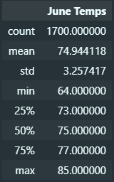

# Surfs Up
## Overview
The purpose of this analysis was to determine summary statistics for temperature and precipitation on the island of Oahu in Hawaii using Python and SQLite in order to determine if a surf and ice cream shop business is sustainable year-round. More specific summary statistics were then filtered and found for the months of June and December.

## Results
- The average temperature during the month of June is ~75 degrees fahrenheit with a minimum of 64 and a maximum of 85 degrees

- The average temperature during the month of December is ~71 degrees fahrenheit with a minimum of 56 and a maximum of 83 degrees

- The standard deviation is relatively low for both the month of June and December at only ~3.5 degrees fahrenheit

## Summary
Given that the standard deviation for both the month of June and December is only ~3.5 degrees fahrenheit, it is likely that a surf and ice cream shop business can operate successfully year-round, with just a few scattered days during the winter months likely to see less business due to colder days.

Additionally, the average amount of precipitation per month is both relatively stable and low at around ~0.15in. Seen in the figure below, precipitation is higher during the later parts of the year, but the change is only about ~0.05in.

Lastly, it should be noted that the standard deviation for precipitation during the months of June and December are higher than those for temperature, with standard deviations of 0.33in and 0.54in respectively. This follows the large difference between the minimum and maximum and even the large difference between the 75% percentile and the maximum. Where the 75% percentile for June and December are 0.12in and 0.15in respectively, the maximum precipitation values for these months are 4.43in and 6.42in.

